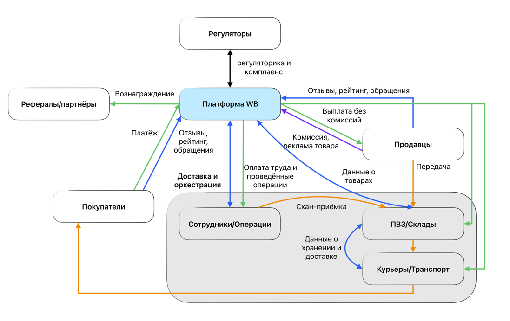

# Токеномика маркетплейса Wildberries

## Executive Summary

В данном документе представлена детальная модель токеномики для токенизированной версии маркетплейса Wildberries.
Предлагается выпустить внутренний utility-токен Wildberries на блокчейне, который задействует все группы стейкхолдеров –
покупателей, продавцов, логистических партнёров (курьеры и пункты выдачи), рефералов и инвесторов
– и позволяет им получать выгоды от развития экосистемы.

# Анализ текущей модели Wildberries

## Стейкхолдеры маркетплейса и их роль

* Покупатели (клиенты) – конечные потребители, приобретающие товары на платформе. Их действия включают поиск и заказ
  товаров, оплату, получение в пункте выдачи или через курьера, а также оформление возвратов и оставление отзывов.
    * Боли покупателей: риск получить товар ненадлежащего качества, сложности с возвратом, время ожидания доставки,
      доверие к отзывам и продавцам. Например, клиенты жаловались на введение платы за возврат – Wildberries начал
      взимать 100 руб. с заказа при отказе от товара, что вызывало опасения у покупателей.
    * Мотивации покупателей: широкий ассортимент и низкие цены за счёт конкуренции продавцов, удобство доставки «до
      двери» или до близкого пункта, возможность вернуть товар, участие в акциях и программах лояльности.
    * Ценность платформы для покупателей – это единое место, где можно быстро и надёжно купить всё необходимое, с
      поддержкой в оплате и доставке.
* Продавцы (селлеры) – компании и предприниматели, реализующие товары через Wildberries. Они размещают карточки товаров,
  управляют ценами и запасами, выполняют отгрузку на склад или напрямую покупателям в зависимости от модели работы.
    * Боли продавцов: высокая комиссия маркетплейса и дополнительные сборы за услуги, жёсткие штрафы за нарушения,
      сложности с логистикой и возвратами, конкуренция и ценовые войны, зависимость от правил платформы. Например,
      Wildberries взимает базовую комиссию с продаж от ~3% до 24,5% в зависимости от категории товара, плюс плату за
      доставку, хранение на складе, эквайринг и пр. – в сумме вознаграждение маркетплейса может достигать 25–30% от цены
      товара.
    * Продавцы сталкиваются с непредсказуемостью: комиссия неоднократно менялась – в 2025 году Wildberries сперва
      повысил комиссионный сбор, затем объявил о программе снижения комиссии на 5–6 п.п. для продавцов, выполнивших план
      по обороту, а позже пообещал заморозить комиссии на 6 месяцев для стабильности.
    * Также существует система штрафов: на 2025 год действует 26 видов штрафов для селлеров (за нарушение авторских
      прав, неправильную маркировку, просрочку отгрузки и т.д.). Например, за возврат покупателем товара продавец платит
      фиксированно 50 руб. за единицу, за отсутствие габаритов в карточке или неправильную поставку – штрафы, которые
      увеличивают издержки.
    * Мотивации продавцов: доступ к огромной аудитории (миллионы покупателей по всей стране), инфраструктура для
      доставки и хранения, которую сложно обеспечить самостоятельно, возможность быстро масштабировать продажи.
    * Платформа даёт продавцу удобные инструменты: личный кабинет с аналитикой, калькуляторы расчёта прибыли с учётом
      всех комиссий и логистики, готовые решения по оплате (Wildberries сам обрабатывает платежи, комиссия эквайринга ~
      1.5–2.5% в РФ) и поддержке клиентов. Для многих бизнесов присутствие на Wildberries – необходимое условие
      выживания на рынке e-commerce, несмотря на издержки.
    * Ценность платформы для продавцов – увеличение продаж и охват новых регионов без вложений в собственную розничную
      сеть.
* Логистика (партнёры по доставке и пункты выдачи) – ключевое звено, обеспечивающее физическое перемещение товара. В
  экосистеме Wildberries логистика включает собственные сортировочные центры и склады (более 100 складов по России и СНГ
  к 2025 г.), службу доставки и обширную сеть пунктов выдачи заказов (ПВЗ). Курьеры осуществляют доставку до двери,
  владельцы ПВЗ – предприниматели-партнёры, открывающие пункты под брендом Wildberries. Их роль – принимать, хранить и
  выдавать заказы покупателям, а также принимать возвраты.
    * Боли логистических партнёров: высокая нагрузка в пиковые периоды, необходимость соблюдать стандарты сервиса,
      зависимость дохода от объёма заказов, который они не контролируют, а также изменения условий со стороны платформы.
      Например, Wildberries периодически меняет тарифы выплат для ПВЗ: с ноября 2024 ввели дополнительные выплаты за
      хранение возвратных товаров поставщиков на ПВЗ, а в декабре 2024 удвоили оплату последнего часа работы пункта при
      продлении графика, чтобы справиться с предновогодним наплывом заказов. Это говорит о том, что доход ПВЗ прямо
      зависит от количества выданных и возвращённых заказов – Wildberries платит партнёрам процент с оборота выданных
      товаров плюс различные бонусы (например, была субсидия ~3% от оборота новым пунктам + разовая выплата до 360k руб
      за 3 мес в зависимости от региона открытия).
    * Мотивации логистических партнёров: зарабатывать на стремительно растущем рынке e-commerce, используя бренд и
      ИТ-систему Wildberries. Для курьеров – каждое доставленное отправление приносит им вознаграждение; для владельцев
      пунктов – комиссионное вознаграждение за каждую выдачу и возврат, которое растёт с увеличением числа клиентов.
      Платформа ценна тем, что привлекает большой поток заказов, а партнёры получают готовый поток клиентов и
      вознаграждение пропорционально объёму продаж.
        * Кроме того, Wildberries поддерживает партнёров в горячий сезон (например, доплачивает за продление работы, как
          указано выше).
* Реферальные партнёры – сюда можно отнести физических лиц или организации, которые приводят новых клиентов или
  продавцов на платформу. Сейчас Wildberries имеет партнёрские программы и акции по приглашению друзей, однако они
  ограничены скидками или бонусами.
    * Боль реферальных агентов – ограниченность вознаграждений и их одноразовость, отсутствие доли в дальнейшем обороте
      привлечённых пользователей.
    * Мотивация же очевидна: возможность заработать бонусы за счёт маркетинговых усилий, рекомендуя популярный сервис. В
      экосистеме токенизированного Wildberries эта группа может играть существенную роль в органическом росте.
* Инвесторы и компания – учредители, акционеры компании Wildberries, а также потенциально новые инвесторы, если
  платформа решит привлечь финансирование. На данный момент Wildberries – частная компания, ее основная выгода –
  комиссионный доход и прибыль от операций. Инвесторы заинтересованы в росте оборота, удержании доли рынка и
  рентабельности.
    * Их боли включают риски насыщения рынка, конкуренцию (Ozon, Яндекс.Маркет и др.), репутационные скандалы и
      регуляторные ограничения.
    * Ценность платформы для собственников – генерирование прибыли за счёт эффективной бизнес-модели маркетплейса.
    * В будущем, при токенизации, традиционные инвесторы могут трансформироваться в держателей определённого количества
      токенов, получая выгоды от роста экосистемы через увеличение ценности токена.

## Схема взаимодействия и денежные потоки

Wildberries функционирует как двухсторонний рынок, связывающий продавцов и покупателей, при поддержке логистики.
Денежный поток типичной транзакции выглядит так: покупатель оплачивает заказ (стоимость товара + доставка, если
платная) – эти средства поступают Wildberries.

Маркетплейс выступает как escrow: удерживает комиссию и все предусмотренные сборы, остальное перечисляет продавцу.
Выплата продавцу обычно происходит с задержкой (например, раз в неделю), что позволяет Wildberries краткосрочно
использовать оборотные средства. С каждого заказа Wildberries извлекает несколько видов дохода (вознаграждений):

* Комиссия с продажи товара – процент от цены товара. Рассчитывается от цены, по которой продавец выставил товар (без
  учета скидок). Размер комиссии привязан к категории: для массовых категорий (одежда, электроника) комиссии ниже (
  порядка 5–15%), для нишевых и крупногабаритных – выше (до 20–25% и более).
    * Пример: для детской одежды комиссия ~15%, для автотоваров ~16,5%, для продуктов питания ~4–10%. Wildberries
      периодически изменяет эти ставки.
    * Также комиссия зависит от модели работы: если продавец сам осуществляет доставку (модель DBS – «Витрина»),
      комиссия ниже, т.к. платформа несёт меньше издержек. Например, автозапчасти: 16,5% при складской модели (FBW/FBS)
      и 3% при прямой экспресс-доставке продавцом.
* Логистические услуги – плата за доставку, хранение, приемку и возврат. Wildberries детально тарифицирует эти услуги.
  Доставка: базовая ставка 38 руб. за небольшой товар + 9,5 руб. за каждый доп. литр объёма, с поправочными
  коэффициентами по складам (коэффициент может повышать стоимость при перегрузке склада или нарушениях поставки).
  Доставка крупногабарита – фикс ~1000 руб.
    * Хранение: для товаров на складах WB – тарифицируется за объем в сутки, опять же с коэффициентом от загруженности
      склада.
    * Приемка товара на склад: 1,7 руб/литр объема поставки, может динамически расти в пиковые сезоны (по отзывам
      селлеров, в декабре на отдельных складах приемка дорожала в 10 раз).
    * Возврат товара покупателем: 50 руб за единицу оплачивает продавец.
    * Утилизация брака/просрочки: 33 руб за единицу товара, если товар не пригоден для продажи.
    * Эти суммы удерживаются Wildberries и покрывают издержки логистики, часто принося и прибыль за счёт масштаба. В
      результате для продавца, использующего полный сервис FBW (fulfillment by Wildberries), совокупный вычет может быть
      значительным.
    * Приведём пример расчёта: продавец продаёт товар за 1000 руб через FBW, объем посылки 2 литра, хранение 1 день.
      Комиссия 22,5% = 225 руб; доставка = 35,63 руб; хранение = 0,12 руб; приемка = 3,4 руб; эквайринг 2% = 20 руб.
      Итого вознаграждение Wildberries ~284 руб (28,4% от цены). Эта сумма удерживается из денег покупателя, остальное ~
      716 руб переводится продавцу. Если же продавец работает по модели FBS (сам хранит и доставляет до сортировочного
      центра), то он бы заплатил: комиссию 225 руб + доставку ~35,63 + эквайринг 20 руб, но без хранения и приемки (
      итого ~280 руб). При модели «витрина» (DBS), когда продавец сам доставляет до покупателя, он платит только
      комиссию и эквайринг, комиссия там снижена (в примере автотовары – 3% вместо 16,5%, значит ~30 руб вместо 225 руб
      комиссии). Таким образом, Wildberries гибко монетизирует либо сервисами, либо комиссией.
* Платёжный эквайринг – Wildberries агрегирует оплату, поэтому берет с продавца плату за транзакцию ~1,5–2,5% для
  платежей из РФ (и 3% для оплат из стран СНГ). Эти проценты покрывают комиссии банков/платёжных систем, но часто
  маркетплейс имеет льготные ставки эквайринга и может получать часть как доход.
* Реклама и доп. услуги – продавцы могут покупать продвижение своих товаров (например, платная выдача в топе поиска,
  участие во внутренних акциях). В тексте Modulbank отмечено, что селлер отчисляет плату и за рекламу тоже. Значит,
  Wildberries зарабатывает на рекламных услугах: продажа баннеров, продвижение в каталоге, внутренние механизмы
  увеличения видимости товара за отдельную плату. Обычно такие услуги увеличивают базовую комиссию на определённый
  процент. По данным Moneyplace, подключение опций продвижения добавляет 0,2–1,5% к комиссии с продаж. Таким образом,
  маркетплейс стимулирует продавцов тратить больше, чтобы получить больше продаж.
* Штрафы и удержания – ещё один источник дохода (хотя формально это плата за нарушения). Wildberries активно штрафует:
  как отмечалось, 26 видов штрафов в 2025 г.. Примеры: штраф 100 руб за каждую единицу товара, от которого покупатель
  отказался при получении, для покупателей с низким процентом выкупа (по сути плата за обратную доставку); штраф 50% от
  цены за неотгруженный вовремя товар; штрафы за ошибки маркировки, отсутствие нужных документов и пр. Эти суммы либо
  вычитаются из выплат продавцу, либо взымаются с покупателя. Например, новость РБК: Wildberries начал массово взимать
  100 руб с покупателей за возврат (отказ) товара, мотивируя это борьбой с недобросовестными заказами. Хотя компания
  утверждает, что такая плата затрагивает ~10% клиентов с очень высоким процентом возвратов, реальность показала, что
  предупреждения о «штрафе» появлялись и у добросовестных покупателей, вызвав волну негатива. Тем не менее, часть
  клиентов стала осторожнее относиться к заказам, а маркетплейс потенциально снизил свои расходы на обратную логистику,
  переложив их на пользователей (и частично монетизировал отказ – ~100 руб за несостоявшуюся продажу).

Суммируя, текущая бизнес-модель Wildberries – это многокомпонентная монетизационная модель, где основным источником
дохода служит комиссия с продаж товаров, дополняемая платежами за логистику, финуслуги и сервисы. Информационные потоки
идут через ИТ-систему платформы: продавец получает информацию о заказе, должен вовремя отгрузить; покупатель получает
уведомления о статусе; пункты выдачи видят ожидающие товары; все отзывы и рейтинги собираются в профилях продавцов.

### Ценность Wildberries для каждой группы

- Для покупателей: удобство, выбор и относительно низкие цены, защищённость (платформа возвращает деньги при браке,
  арбитраж спорных ситуаций – пока централизованный).
- Для продавцов: большой рынок с готовой логистикой и клиентской базой, что перевешивает комиссионные издержки.
- Для логистических партнёров: доступ к гигантскому числу отправлений, гарантированные выплаты за объём, поддержка
  масштабирования (платформа стимулирует открытие ПВЗ субсидиями, как мы видим).
- Для инвесторов (владельцев): прибыль и рост бизнеса, возможность доминировать на рынке благодаря экосистеме и
  масштабному эффекту.

Однако текущая схема имеет и проблемные зоны, которые токенизация могла бы улучшить:

- Отсутствие у покупателей и продавцов «доли» в успехе платформы – сейчас только владельцы получают прямую выгоду от
  роста Wildberries.
    - Это может снижать лояльность: продавцы чувствуют себя зависимыми контрагентами, а не партнёрами.
- Сложные взаимоотношения при спорах – сейчас Wildberries самостоятельно арбитражит конфликты, что требует ресурсов и
  часто вызывает недовольство решением той или иной стороны.
- Программа лояльности ограничена скидками (СПП) и привязана к аккаунту: баллы/скидки нельзя свободно передать или
  обменять, они сгорают и не конвертируются во внешнюю ценность.
- Продавцы несут значительные издержки на маркетинг внутри платформы (поднимают рейтинг товара за счёт низкой цены и
  акций), но эти вложения никак не капитализируются – по сути, постоянный «налог» на присутствие.
- Wildberries уже превращается в финансовую платформу (планировал брокерскую лицензию, запустил краудфандинг инвестиций
  для клиентов) – логичным шагом выглядит создание собственного цифрового актива, с помощью которого можно привлекать
  капитал и управлять внутренней экономикой.

### Экосистема взаимодействий

# Концепция внедрения токена

## Зачем маркетплейсу нужен токен

Введение токена Wildberries преследует несколько ключевых бизнес-целей:

* Мотивация и лояльность участников: Токен превращает покупателей, продавцов и даже курьеров в соучастников экосистемы.
  Награждая их токенами за полезные действия, платформа повышает вовлечённость.
    * Например, покупатели будут получать кешбэк в токенах за каждую покупку, а продавцы – токены за достижение
      оборотных целей или высокие рейтинги. В отличие от традиционных баллов лояльности, токен – полноценный цифровой
      актив, его можно накапливать, обменивать, продавать, что сильнее мотивирует участников. Если сейчас скидочные
      баллы часто остаются неиспользованными и «сгорают», то токены приобретают реальную ценность: их можно потратить не
      только на Wildberries, но и продать или конвертировать, что удовлетворяет ожидания современных пользователей (
      особенно поколений Y и Z) иметь гибкую и ценную систему вознаграждений.
* Усиление доверия и прозрачности: Блокчейн обеспечивает неизменяемую запись важных событий – заказов, отзывов,
  рейтингов, спорных ситуаций.
    * Например, отзывы покупателей и рейтинг продавца могут храниться в виде токенизированных репутационных показателей
      на блокчейне, чтобы их нельзя было задним числом удалить или подтасовать.
    * Это повышает доверие: ни продавец, ни маркетплейс не смогут скрыть негативные отзывы, а покупатели уверены, что
      рейтинг честный.
    * Кроме того, смарт-контракты могут автоматически выполнять правила – «код вместо посредника». Пример: если
      покупатель вовремя вернул товар, смарт-контракт по заранее заданным условиям разблокирует ему оплату, не требуя
      ручного подтверждения от оператора. Отсутствие человеческого фактора снижает риск ошибок или злоупотреблений.
    * В глазах пользователей токенизованная система – более честная и открытая, т.к. многие процессы алгоритмичны и
      проверяемы всеми участниками.
* Решение текущих проблем бизнес-модели: Токен может адресовать конкретные боли. Например, непредсказуемость комиссий –
  можно зафиксировать базовые уровни комиссии и их изменение выносить на голосование держателей токенов (включая самих
  продавцов), что придаст стабильность и предсказуемость взаимодействия.
    * Высокие возвраты и недобросовестные заказы: вместо прямых штрафов покупателям можно ввести экономический
      механизм – залоги в токенах или рейтинг, влияющий на вознаграждения.
    * Например, покупатель с хронически низким выкупом будет просто меньше получать токенов кэшбэка, либо будет обязан
      внести депозит токенов при заказе на крупную сумму. Это мягкая мотивация «заказывать осознанно» без грубых
      штрафных уведомлений, которые вредят лояльности.
    * Финансирование роста: выпуск токенов дает возможность привлечь капитал от крипто-инвесторов и сообщества без
      прямой продажи долей компании – по сути, аналог IPO, но в виде токенсейла. Полученные средства можно инвестировать
      в склады, ИТ-инфраструктуру, международную экспансию, а инвесторы-токенхолдеры заинтересованы в успехе компании,
      повышающем ценность их токенов.
* Почему блокчейн, а не “обычные баллы”: Программы лояльности существуют давно, но традиционные баллы привязаны к одной
  компании, не обладают ликвидностью и часто обесцениваются (компания может менять курс конвертации или срок жизни
  баллов).
    * Блокчейн-токены лишены этих недостатков: они торгуемы на рынке и имеют рыночную цену, пользователи могут свободно
      обменивать их между собой или продавать.
    * Например, если покупатель накопил много бонусов Wildberries, а хочет купить авиабилет, он сможет продать токены
      или – в перспективе – использовать их напрямую у партнёров (если будет создана межбрендовая система).
    * Согласно исследованиям, 39% пользователей программ лояльности хотят обменивать баллы между разными магазинами –
      токенизация это позволяет при условии, что другие бренды принимают или обменивают данный токен.
    * Кроме того, блокчейн-токен функционирует по предсказуемым правилам (смарт-контракт эмиссии, сжигания и т.п.), его
      нельзя «напечатать» сверх оговоренного, тогда как компанию ничто не останавливает от девальвации балльной
      программы. Таким образом, токен формирует у участников ощущение собственности: они владеют частью экосистемы, а не
      просто получают скидку. Это сильнее стимулирует повторные покупки и участие – игрок с капиталом (токеном) будет
      более привержен платформе.
* Новые механики и децентрализация процессов: Благодаря токену можно внедрить децентрализованное управление (DAO)
  определёнными аспектами работы площадки. Например, вынести на голосование сообщества, в каких странах открывать новые
  склады или какие категории товаров развивать. Держатели токенов (покупатели, продавцы – все, кого это касается) смогут
  голосовать пропорционально доле токенов. Это повышает качество решений и удовлетворённость: решения принимаются
  консенсусом заинтересованных сторон, а не кулуарно. Также токен открывает возможность краудсорсинга процессов –
  например, сообщество токенхолдеров может участвовать в модерации отзывов или контента, получая за это токены. Всё это
  ведёт к более устойчивой и саморегулирующейся экосистеме.

## Токеномика: модели распределения и расчёты

Переходим к разработке токеномики Wildberries: будут описаны модели распределения токена WBX между стейкхолдерами,
формулы эмиссии и вознаграждений, а также общий баланс выпуска и сжигания. Предполагается, что WBX имеет ограниченную
или контролируемую эмиссию и используется во всех рассматриваемых сценариях.

1. Предложение для покупателей:
    - Покупатели будут получать WBX-токены как кэшбэк и бонусы за активность на платформе.
    - Базовая механика – кэшбэк с каждой покупки: например, $1–5\%$ от суммы заказа возвращается покупателю в виде токенов
      WBX.
    - Формула кэшбэка может быть плавающей: чем выше уровень лояльности (или объем покупок пользователя), тем больший
      процент он получает.
    - Пример формулы: $RewardTokens = purchaseAmount * R(tier)$, где $R(tier)$ – коэффициент кэшбэка для уровня
      лояльности. Допустим, новый клиент (Tier 1) получает $1\%$, постоянный (Tier 3) – 3%. Тогда при заказе на 10 000 ₽
      новичок получит токенов на сумму 100 ₽, а лояльный клиент – на 300 ₽.
    - Эти проценты могут быть выбраны исходя из маржинальности – Wildberries сейчас даёт СПП-скидку покупателям
      порядка $5–10%$, но за счёт продавца. Переводя часть этой нагрузки на токены, платформа может снизить прямую
      скидку, заменив её ценностью токенов.

   Бонусные токены могут начисляться не только за кэшбэк, но и за отзывы, участие в акциях, высокую активность и
   рефералов; все такие награды должны быть прозрачными и ограниченными, чтобы не размывать экономику токена. Раздача
   WBX покупателям — это инвестиция в удержание: токен мотивирует на долгосрочное взаимодействие и даёт более гибкий
   инструмент стимулирования спроса, чем скидки, поскольку его размер можно адаптировать без прямых фиатных затрат.

2. Предложение для продавцов:
    - Продавцы будут вовлечены через сочетание вознаграждений и требований в токенах. Главные механики: бонусы за
      продажи, снижение комиссии за стейкинг, требования стейка для определённых привилегий.
    - Бонус за объём продаж: аналогично программе, что Wildberries недавно объявил (снижение комиссии при достижении
      плана), но вместо скидки по комиссии продавец получает токены.
        - Например, если продавец превысил квартальный план продаж на $X$ рублей, ему начисляется $Y$ WBX.
          Формула: $Y = f(turnover)$, скажем, $0,1\%$ от суммы продаж сверх плана. Если план $1$ млн, а сделано $1,2$
          млн, то бонус $= 0,1\% * 200k = 200$ ₽ в токенах. Это как кэшбэк для продавца.
        - Возможно, стоит делать не от перевыполнения, а от общего оборота – например, $0,05\%$ от выручки всеми
          селлерами возвращается им в токенах пропорционально их вкладу.
        - Это поощрит продавцов наращивать ассортимент, маркетинг и т.д., ведь помимо обычной прибыли, они получают
          “долю рынка” в виде токена.
    - Снижение комиссии за стейкинг токенов: если продавец замораживает определённое количество WBX, то платформа
      снижает комиссию на его товары.
        - Логика: продавец проявляет лояльность и доверие, вкладываясь в токены, за это Wildberries делится с ним
          выгодой.
            - Пример механики: базовое снижение комиссии $1\%$ за каждые $N$ токенов на счёте продавца. Можно установить
              пороги: держишь токенов на сумму $≥100k$ ₽ – комиссия на все продажи снижается на 1 п.п.; $≥500k$ ₽ – на 2
              п.п. (в пределах минимумов).
            - Предположим, продавец с годовым оборотом $10 млн ₽ $обычно платит $~15\%$ комиссии ($1,5$ млн). Если он
              застейкает, скажем, токены на $500k ₽$, его комиссия станет $13\%$, экономия $~200k ₽$, что очень ощутимо.
              Для него это смысл: токен даёт прямую финансовую выгоду в виде снижения издержек. Для платформы тоже плюс:
              токены выведены из обращения, что поддерживает курс, а продавец меньше склонен уходить на другие площадки,
              раз уж вложился.
        - Формула может быть нелинейной, чтобы крупные селлеры не получали слишком огромного дисконта: например,
          снижение $= min( baseCommission * (stakeValue / X), maxDiscount )$. Тут $X$ – сумма стейка,
          соответствующая $100\%$ комиссии за период. Нужно подобрать $X$ так, чтобы $maxDiscount$, например $50\%$ от
          комиссии, достигался при стейке примерно равном годовому комиссионному платежу.
            - То есть если продавец застейкал токены примерно равные сумме всех комиссий за год, он получает половину
              комиссий обратно как скидку. Это как бы возвращает ему часть денег, но через токены и приверженность
              экосистеме.

   Продавцы могут использовать токены как stake для доступа к привилегиям (выход на новые рынки, участие в крупных
   распродажах, право апелляции в спорах) и получать WBX за высокое качество сервиса или развитие ассортимента; все
   такие механики должны быть прозрачными и лимитированными. Токен-стейкинг снижает комиссионную нагрузку, повышает
   лояльность продавцов и служит обеспечением качества, создавая саморегулируемую систему, где добросовестные продавцы
   выигрывают, а недобросовестные несут потери.

3. Предложение для логистических партнёров:
   - Вознаграждение ПВЗ и курьеров: Сейчас пункты выдачи получают выплату в рублях за каждую операцию (выдачу/возврат), плюс иногда бонусы от Wildberries (как удвоенная оплата за час в декабре). Предлагается часть этих бонусов заменить/дополнить токенами WBX.
       - Модель: ежемесячно Wildberries выделяет пул токенов для логистики $LPool = k * totalDeliveryIncome$, где $totalDeliveryIncome$ – общая сумма, уплаченная покупателями за доставку за месяц, а $k$ – небольшой коэффициент (например, $5\%$). Этот пул распределяется между всеми партнёрами пропорционально их вкладу и рейтингу.
           - Например, пункт выдачи, обработавший 1000 заказов с рейтингом 4.8 из 5, получит больше токенов, чем пункт с 1000 заказов и рейтингом 4.2. Формула может быть: $PartnerReward = LPool * (ordersPartner * qualityFactor) / Σ(ordersAll * qualityFactor)$. $QualityFactor$ – нормированный показатель качества (например, отношение среднего рейтинга пункта к максимальному). Так, лучшие по сервису ПВЗ и курьеры получат повышенное вознаграждение в токенах помимо базовой оплаты. Для курьера метрика качества – процент вовремя доставленных посылок, отсутствие жалоб, рейтинг получателей.
   - Стейкинг токена для партнёров: Каждый владелец ПВЗ и крупный логистический подрядчик может быть обязан внести обеспечительный стейк в токенах при подключении к платформе. Это аналог залога, который гарантирует соблюдение стандартов.
       - Например, при открытии пункта выдачи партнёр стейкает 10 000 WBX (можно купить или получить кредит от Wildberries под обещание будущих доходов). Если пункт систематически нарушает правила (теряет товары, мошенничает с отметками выдачи), из этого стейка автоматически взыскиваются штрафы. В случае грубого нарушения, платформа может конфисковать часть токенов (сжечь или направить пострадавшим). Зато для добросовестных партнёров этот стейк не расходуется, более того – может приносить доход: можно предусмотреть, что на застейканные токены ПВЗ получают доп. выплаты (проценты), либо увеличение доли в распределении пула вознаграждений. Это побудит их держать stake, а не сразу выводить.
       - Бонусы за инициативы: Wildberries может поощрять токенами расширение сети и качественное покрытие. Пример: открытие пункта в малом городе, где нет присутствия, – выделяется грант в токенах первым N партнёрам, кто там откроется. Или курьер, который взял дополнительные районы (увеличил зону покрытия) – ему единоразовый бонус WBX. Эти программы стимулируют рост инфраструктуры.

4. Предложение для рефералов и маркетинга:
    - Эта группа получает токены в качестве вознаграждения за рост аудитории.
      - Модель простая: Referral drop. Каждый раз, когда реферер привёл нового покупателя или продавца, он получает фиксированное число токенов WBX (или процент от первой транзакции привлечённого). Для привлечения продавцов может быть и выше награда, т.к. продавец приносит оборот: например, 500 WBX за нового селлера, достигшего первых 100 тыс. ₽ продаж. Эти цифры надо скорректировать по курсу токена, но идея – сформировать армия агентов, заинтересованных продвигать Wildberries.
      - В традиционном маркетинге за лиды платят фиатом, но токен здесь уместнее, потому что: а) не требует сразу отвлекать деньги (токены из резервов компании); б) привлекает крипто-энтузиастов, которые могут стать амбассадорами бренда.
    - Можно рассмотреть баунти-программы: вознаграждение токенами за обзоры, упоминания в соцсетях, контент о Wildberries.
      - Всё это относится к маркетинговому распространению токена. Обычно при токенсейлах 1–3% токенов выделяют на баунти.
      - Предлагается иметь пул для таких активностей, аккуратно контролируя выдачу (чтобы не завалить рынок лишними токенами).
    - Реферальный маркетинг с токеном даст взрывной эффект сарафанного радио. Люди начнут рекомендовать платформу, потому что за это не просто скидку дадут, а передаваемый актив.
      - Например, приглашая друга, я фактически получаю часть будущей прибыли платформы (через токены). Это сильнее мотивирует, чем разовый купон на 200 ₽
      - К тому же, рефералы будут стараться не просто пригласить, но и помочь новому пользователю (чтобы тот успешно сделал покупку и обе стороны получили награду).

5. Предложение для инвесторов: отдельно стоит описать начальное распределение токенов инвесторам и команде, т.е. генезис и аллокация. Предположим, решено выпустить ограниченный объём WBX (например, 1 миллиард токенов). Он распределяется так:
   - Продажа инвесторам (Private Sale/ICO) – например, 20% токенов. Это привлечение средств: допустим, 200 млн токенов продаётся по фиксированной цене (или по плавающей через bonding curve – об этом ниже), вырученные деньги идут в компанию на развитие. Инвесторами могут быть как фонды, так и пользователи Wildberries, желающие вложиться. Чтобы сохранить баланс сил, доля инвесторов не должна быть доминирующей.
   - Команда и учредители – например, 15% токенов. Это вознаграждение основателям, менеджменту, разработчикам. Важно: эти токены ввводятся с длительным вестингом (размораживаются постепенно за 2-3 года), чтобы исключить дамп и чтобы команда была мотивирована долго поддерживать стоимость токена (совпадение интересов с инвесторами).
   - Резерв платформы – например, 10%. Нужен для непредвиденных ситуаций, стратегических партнёрств, листинга токена на биржах (маркет-мейкинга). Может также использоваться для байбека токенов, если решат часть прибыли направлять на выкуп.
   - Сообщество и экосистема (Reward Pool) – оставшиеся ~55%. Это токены, предназначенные для всех вышеописанных вознаграждений: покупателей, продавцов, логистики, рефералов. Они не раздаются сразу, а выпускаются постепенно в обращение по заданным правилам. Например, может быть смарт-контракт эмиссии, который каждый блок (или каждый день) выпускает небольшое фиксированное количество токенов на адрес RewardPool, откуда уже распределяются по механикам (кэшбэк, бонусы и т.п.).

# Аллокация и bonding curves: согласование моделей эмиссии

## Аллокация токенов 

| Категория получателей      | Назначение / Цель                                         | Доля от общего пула |
|:---------------------------|:----------------------------------------------------------|:--------------------|
| **Покупатели**             | Кэшбэк, отзывы, программы лояльности                      | 25%                 |
| **Продавцы**               | Бонусы, скидки, стимулирование                            | 15%                 |
| **Логистические партнёры** | Вознаграждение за услуги доставки и логистики             | 5%                  |
| **Рефералы и маркетинг**   | Привлечение новых пользователей, маркетинговые кампании   | 5%                  |
| **Резервный фонд**         | Особые программы, новые инициативы (например, governance) | 5%                  |
| **Итого**                  |                                                           | **55%**             |

Оставшиеся 45%, могут быть распределены на другие цели (команда, инвесторы, экосистемное развитие).  Эта пропорция настраивается динамически, исходя из того, какая группа сильнее влияет на рост. Например, первые год-два
может больше уйти на привлечение покупателей, потом фокус сместится на поощрение продавцов и качество сервиса.

Такой подход (ограниченный первоначальный supply + плавная эмиссия) позволит контролировать инфляцию. Можно заложить, что полное распределение этих 55% произойдёт за, скажем, 10 лет. Тогда годовой «бюджет» на вознаграждения – 5,5% от общего объёма. При грамотном сжигании эта инфляция может компенсироваться.

## Bonding Curve для продажи токенов

**Покупатели: cashback-based bonding curve**

Задача покупателей — стимулировать GMV и удержание. Я задаю выпуск токенов как функцию суммы покупки $V$ и текущего предложения $S$, чтобы кэшбек размывался по мере роста системы (раньше — больше, позже — меньше). Пусть $r_{\max}$ — верхняя граница кэшбека в токенах, $r_{\min}$ — нижняя, тогда доля кэшбека как функция supply:

$$r(S)=r_{\min}+(r_{\max}-r_{\min})e^{-\mu S}$$

Тогда количество токенов, выдаваемых покупателю за покупку на сумму $V$, если курс токена для расчёта берём как $P(S)$, равно:

$$\Delta S_{\text{buyer}}=\frac{r(S)\,V}{P(S)}$$

Один и тот же фиатный кэшбек превращается в меньшее число токенов, если токен дороже, и дополнительно уменьшается, когда $S$ большой

**Продавцы: bitcoin-like emission (майнинг за листинг и продажи с halving)**

Цель продавцов — рост ассортимента, качества карточек и оборота. Здесь логика ближе к майнингу: выдаём награду за полезные действия, но уменьшаем её во времени. Пусть $t$ — номер эпохи (например, каждые 3 месяца новая эпоха), $E_0$ — базовая награда на старте, тогда halving:

$$E(t)=E_0\cdot 2^{-\left\lfloor \frac{t}{T_h}\right\rfloor}$$

Награду продавцу я задаю как сумму двух компонент: за качество листинга и за продажи (обе масштабируются текущей эпохой $E(t)$ ). Пусть $q\in[0,1]$ — нормированное качество (рейтинг, возвраты, контент), $L$ — число новых/обновлённых карточек, $\mathrm{GMV}$ — оборот продавца, тогда:

$$\Delta S_{\text{seller}}=E(t)\left(\alpha\,L\,q+\beta\,\frac{\mathrm{GMV}}{P(S)}\right)$$

Здесь $\alpha$, $\beta$ задают относительный вес контента и продаж. Деление $\mathrm{GMV}/P(S)$ переводит фиатный вклад в токеновый вклад: при более дорогом токене за тот же $\mathrm{GMV}$ выдаётся меньше токенов.

**Логистика/курьеры: эмиссия за SLA и страхование**

Цель логистики — качество и устойчивость. Тут удобно выпускать токены за измеримые SLA-метрики и одновременно требовать залог (стейк), который можно слэшить при нарушениях. Пусть $\mathrm{GMV}_{\text{del}}$ — доставленный оборот, $u\in[0,1]$ — индекс качества (своевременность/целостность), тогда награда:

$$\Delta S_{\text{log}}=\kappa\,u\,\frac{\mathrm{GMV}_{\text{del}}}{P(S)}$$

А штраф (не эмиссия, но связанная токеномика) при инцидентах severity $s\in[0,1]$ и депозите $D$:

$$\mathrm{Slash}(D,s)=\min(\lambda s D,\; D)$$

**Рефералы/партнёры: emission за подтверждённый прирост GMV**

Цель — привлечение чистого трафика, а не арбитраж бонусов. Поэтому награда зависит от подтверждённого $\mathrm{GMV}_{\text{ref}}$ (после окна возвратов/фрода) и может уменьшаться при насыщении (аналогично supply-decay). Пусть $\sigma(S)=\sigma_0 e^{-\nu S}$, тогда:

$$\Delta S_{\text{ref}}=\sigma(S)\,\frac{\mathrm{GMV}_{\text{ref}}}{P(S)}$$

**Валидаторы/арбитры: эмиссия за разрешение споров**

Цель — честное и быстрое разрешение споров. Награда должна быть привязана к объёму спора и сложности, и выплачиваться тем, чьё решение совпало с финальным исходом. Пусть $\mathrm{Value}$ — сумма спора, m — коэффициент сложности, тогда пул наград:

$$\Delta S_{\text{arb,pool}}=\xi\,m\,\frac{\mathrm{Value}}{P(S)}$$

Если $N_{\text{correct}}$ — число “правильно” проголосовавших валидаторов, их индивидуальная награда:

$$\Delta S_{\text{arb},i}=\frac{\Delta S_{\text{arb,pool}}}{N_{\text{correct}}}$$

**Инвесторы/резерв платформы: фиксированная аллокация (не эмиссия по действию)**

На этом этапе можно считать, что для этих групп предложение задаётся не формулой за действи”, а параметрами распределения. Например, фиксированный резерв $S_{\text{treasury}}$ и вестинг $V(t)$. В простейшем виде:

$$S_{\text{unlock}}(t)=S_{\text{treasury}}\cdot \min\left(1,\frac{t}{T_v}\right)$$

### Согласование модели

Для согласивания зафиксирую инвариант - в каждый момент времени существует единый глобальный бюджет выпуска, а все частные формулы превращаются из абсолютной эмиссии в заявку на долю бюджета. Тогда модели могут быть какими угодно разными по смыслу (cashback, halving-майнинг, SLA-награды), но на выходе они всегда укладываются в одно ограничение по суммарному выпуску.

Вводится динамика обращения токена в дискретном времени по эпохам $t=0,1,2,\dots$, где эпоха — неделя или месяц. Состояние системы — циркулирующее предложение $S_t$ , а два потока — выпуск $M_t$ и сжигание $B_t$ . Тогда базовое уравнение баланса предложения выглядит так:

$$S_{t+1}=S_t+M_t-B_t.$$

При нормальной загрузке мы проектируем режим, в котором математическое ожидание чистого прироста мало по модулю, то есть $\mathbb{E}[M_t]\approx \mathbb{E}[B_t]$ (нейтрально) или $\mathbb{E}[M_t]<\mathbb{E}[B_t]$ (дефляционно), а не наоборот. Это и есть то улосиве, который не даст противоречий: сколько бы разных каналов выдачи ни существовало, все они обязаны проходить через $M_t$.

Зададим $M_t$. Если в системе есть EIP-1559-подобное сжигание базовой комиссии, то естественный способ сделать экономику саморегулируемой — связать выпуск наград с тем, сколько токенов было реально изъято из обращения. Самая прозрачная форма — пропорция плюс защитные ограничители:

$$M_t=\text{clip}\!\Big(\kappa\,B_t,\; M_{\min},\; M_{\max}\Big)$$,

где $\kappa$ — коэффициент «эмиссия на единицу бёрна», а $\text{clip}$ обрезает значение снизу и сверху.

Если целевой режим нейтральный, то в точке нормы выбирается $\kappa\approx 1$; если хочется лёгкой дефляции при росте, то берётся $\kappa<1$. При падении активности автоматически падает и $B_t$, значит падает и $M_t$, и токены не выбрасываются в рынок в период слабого спроса.

Но одной связи с burn иногда мало: в ранней фазе бёрн может быть маленьким, а стимулировать рост нужно. Добавим компоненту из заранее выделенного пула стимулов $I_t$ ), который размораживается по расписанию, и опять же зажимается в коридор:

$$M_t=\text{clip}\!\Big(\kappa\,B_t+\omega\,I_t,\; M_{\min},\; M_{\max}\Big).$$

Здесь $\omega\in[0,1]$ задаёт, какая доля запланированного размораживания реально идёт в выпуск, и этот коэффициент можно тоже сделать адаптивным.

---

Введём измеримую метрику активности, например $\mathrm{GMV}_t$ , и нормируем её на целевое значение $\mathrm{GMV}^{\star}$ . Тогда темп эмиссии можно подстраивать сглаженной функцией, которая уменьшает выпуск при спаде и слегка повышает при перегреве, но без разрыва:

$$\kappa_t=\text{clip}\!\left(\kappa_0\left(\frac{\mathrm{GMV}_t}{\mathrm{GMV}^{\star}}\right)^{\eta},\;\kappa_{\min},\;\kappa_{\max}\right), \qquad M_t=\text{clip}\!\Big(\kappa_t\,B_t+\omega\,I_t,\; M_{\min},\; M_{\max}\Big).$$

Тут $\eta>0$ задаёт чувствительность к изменению оборота: при падении $GMV_t$ выпуск сжимается автоматически, при росте — расширяется, но не выходит за $[\kappa_{\min},\kappa_{\max}]$ . 

Таким образом, каждая частная модель перестаёт быть прямым выпуском и становится заявкой $D^{(g)}_t$ от группы $g$. Например, покупательский cashback-механизм хочет выдать $\tilde{D}^{(\text{buyer})}_t$ , продавцы по halving-формуле хотят $\tilde{D}^{(\text{seller})}_t$, логистика по SLA хочет $\tilde{D}^{(\text{log})}_t$, рефералы хотят $\tilde{D}^{(\text{ref})}_t$, арбитры хотят $\tilde{D}^{(\text{arb})}_t$, тогда:

$$D^{(g)}_t=M_t\cdot\frac{\tilde{D}^{(g)}_t}{\sum_h \tilde{D}^{(h)}_t}. $$

---

Формализую подход с верхнеуровневой аллокацией, а внутри которой есть своя механика: существует общий лимит предложения $S_{\text{total}}$, а внутри него выделены корзины $S^{(g)}_{\max}$ по группам, причём сумма корзин не превышает общего лимита. На уровне времени это означает, что выдача группе ещё ограничена остатком корзины:
$$ D^{(g)}_t\le S^{(g)}_{\max}-S^{(g)}_t, \qquad \sum_g S^{(g)}_{\max}\le S_{\text{total}}.$$

Тогда покупатели могут жить в своей «cashback-корзине» и даже использовать внутри неё bonding curve-логику расчёта объёма, продавцы могут жить в своей «halving-корзине» и следовать bitcoin-like уменьшению наград по эпохам, логистика — в своей корзине SLA-бонусов, но вся система остаётся непротиворечивой, потому что каждая группа физически не может превысить свой $S^{(g)}_{\max}$, а суммарно все корзины не могут превысить $S_{\text{total}}$. В этом варианте bonding curve может быть использована локально как «внутренняя цена/норма выдачи» внутри конкретной корзины, не ломая общую эмиссию.

Суммарная выдача не должна существенно превышать суммарное потребление. Потребление я фиксирую двумя главными потоками: комиссионным сжиганием $B_t$ (например, EIP-1559 base fee) и добровольными сжиганиями/блокировками в утилитах (промо-бёрны за приоритет, штрафы, слэшинг). Если обозначить суммарное утилити-сжигание как $U_t$, то общий отток становится $B_t+U_t$, и условие «примерного равновесия» в нормальном режиме формулируется как:

$$\mathbb{E}[M_t]\approx \mathbb{E}[B_t+U_t].$$

Если комиссия в токенах задаёт burn как долю оборота, то при $\mathrm{GMV}_{\text{year}}$ и доле burn $\phi$ (в токен-эквиваленте) получаю оценку годового сжигания:

$$\mathrm{Burn}_{\text{year}}\approx \phi\cdot \frac{\mathrm{GMV}_{\text{year}}}{P_{\text{avg}}}.$$

Если общий выпуск наград за год равен $\mathrm{Mint}_{\text{year}}$, то чистая инфляция в токенах — это 
$$\mathrm{Mint}_{\text{year}}-\mathrm{Burn}_{\text{year}}-\mathrm{UtilBurn}_{\text{year}},$$
а в относительных терминах по обращению $S_{\text{circ}}$ она равна:

$$\mathrm{Infl}_{\text{net}}\approx \frac{\mathrm{Mint}_{\text{year}}-\mathrm{Burn}_{\text{year}}-\mathrm{UtilBurn}_{\text{year}}}{S_{\text{circ}}}.$$
